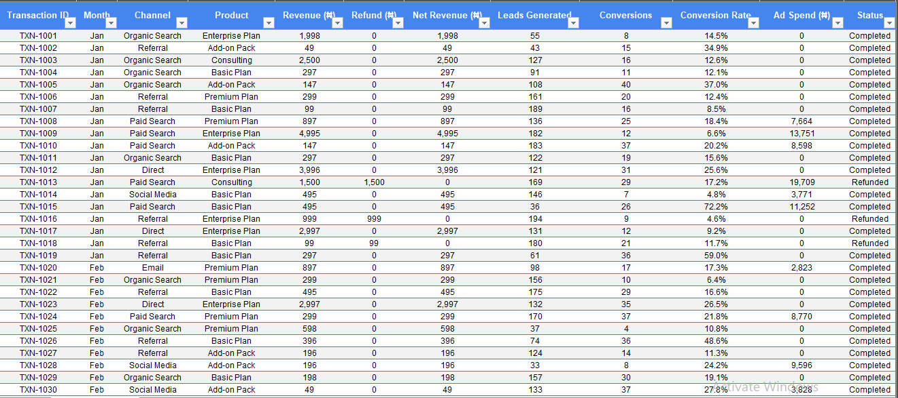
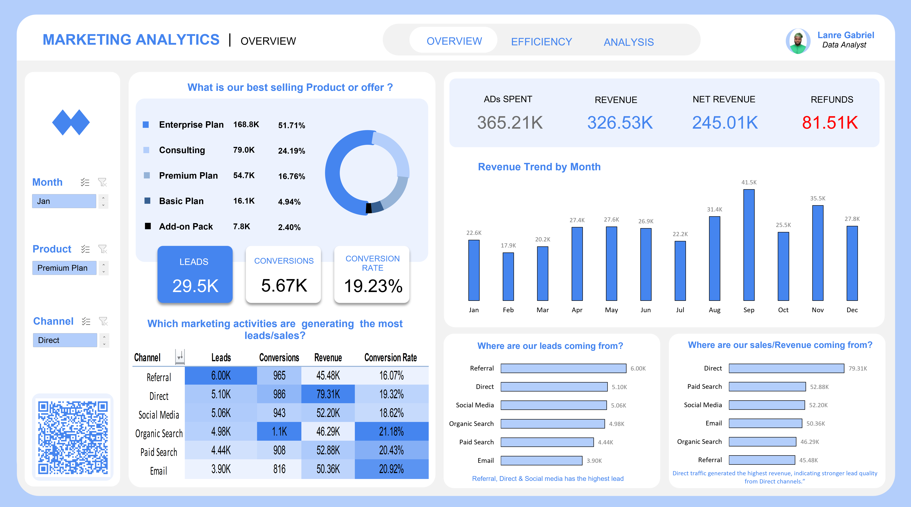
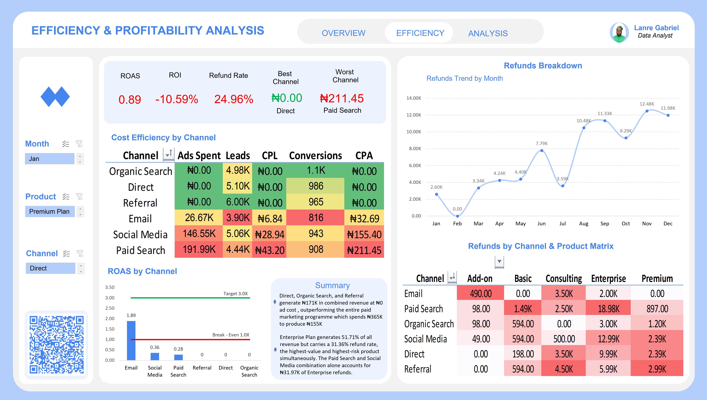

# Marketing-Analytics

### A Two-Page Interactive Excel Dashboard for a B2B SaaS Business


**Analyst:** Lanre Gabriel · Data Analyst
**Tool:** Microsoft Excel — Pivot Tables · DAX Measures · Slicers · Conditional Formatting
**Dataset:** Synthetic B2B SaaS · 280+ Transactions · 6 Channels · 5 Products · FY 2025
**Currency:** Nigerian Naira (₦)

---

## Table of Contents

1. [Introduction](#1-introduction)
2. [Problem Statement](#2-problem-statement)
3. [Aim and Objectives](#3-aim-and-objectives)
4. [Project Workflow](#4-project-workflow)
5. [Data Source and Assumptions](#5-data-source-and-assumptions)
6. [Raw Dataset Overview](#6-raw-dataset-overview)
7. [Data Cleaning Procedure](#7-data-cleaning-procedure)
9. [Analysis and Calculations](#9-analysis-and-calculations)
10. [KPI Reference Table](#10-kpi-reference-table)
11. [Data Visualization — Page 1 Overview](#11-data-visualization--page-1-overview)
12. [Data Visualization — Page 2 Efficiency](#12-data-visualization--page-2-efficiency)
13. [Insights](#13-insights)
14. [Recommendations](#14-recommendations)
15. [Conclusion](#15-conclusion)
16. [Limitations](#16-limitations)
17. [Tools and Technology](#17-tools-and-technology)

---

## 1. Introduction

A marketing team is investing budget across six acquisition channels ( Organic Search, Paid Search, Social Media, Email, Referral, and Direct ) and selling five product lines to business clients across a full fiscal year. Despite generating revenue across all channels, the team has no structured visibility into which channels are actually profitable, which products carry the highest return risk, and whether the paid advertising investment is generating positive or negative returns.

This project conducts a full marketing analytics investigation to answer nine core business performance questions, diagnose efficiency and profitability gaps across paid and organic channels, and deliver three specific data-backed recommendations.

The analysis is built entirely in Microsoft Excel using Pivot Tables, DAX measures, and an interactive two-page dashboard with dynamic slicers, making it replicable by any analyst working in a standard business environment without specialist software.

**Page 1** answers the nine core business questions — **leads, revenue, conversions, product performance, and monthly trends.**

**Page 2** goes deeper into efficiency and profitability — **ROAS, ROI, CPL, CPA, and a full refund breakdown by channel, product, and month.**

---

## 2. Problem Statement

A B2B SaaS business operating across six marketing channels and five product lines has no structured visibility into the performance of its marketing investments. Specifically:

- It does not know which channels are generating leads versus which are generating revenue
- It cannot identify whether its paid advertising investment is returning positive value
- It has no mechanism to track refund patterns by channel or product
- It cannot compare the cost efficiency of acquiring customers across different channels
- It has no monthly revenue trend analysis to inform campaign timing decisions

Without answers to these questions the business risks continuing to invest in underperforming channels, missing opportunities in high-performing ones, and allowing a growing refund problem to erode margins undetected.

This analysis was conducted to answer nine core business performance questions and to surface additional findings that the business did not know to ask about.

---

## 3. Aim and Objectives

### Aim
To conduct a complete marketing analytics investigation that answers nine core business questions, identifies efficiency and profitability gaps, and delivers actionable recommendations — using Microsoft Excel as the primary analysis tool.

### Objectives

1. To identify the highest and lowest performing marketing channels by lead volume, revenue generated, and conversion rate
2. To calculate and compare ROAS, ROI, CPL, and CPA across all paid marketing channels
3. To analyse refund patterns by channel, by product, and over time to identify the highest-risk combinations
4. To visualise revenue performance trends across twelve months against a monthly target
5. To build an interactive two-page Excel dashboard with slicers enabling dynamic filtering by month, product, and channel
6. To document the complete analytical process in a format accessible to both technical and non-technical readers
7. To provide three specific, data-backed business recommendations with clear rationale

---

## 4. Project Workflow

The project followed a structured end-to-end analytics workflow across ten stages:

```
Stage 1   →   Business requirements gathering : nine core marketing
              performance questions defined.
Stage 2   →   Dataset design : defining columns, channels, products,
              and relationships
Stage 3   →   Synthetic data construction in Microsoft Excel
Stage 4   →   Data quality audit : ad spend error discovered
              and investigated
Stage 5   →   DAX measure development and error correction
              using SUMMARIZE
Stage 6   →   Pivot table construction : one per business question
Stage 7   →   Dashboard design : Page 1 Overview (Q1 through Q9)
Stage 8   →   Dashboard design : Page 2 Efficiency
              (ROAS, ROI, CPL, CPA, Refunds)
Stage 9   →   Insight extraction and recommendation
Stage 10  →   Full project documentation
```

Each stage informed the next. The data quality issue discovered in Stage 4 fundamentally changed the ROAS and ROI findings, confirming why validation must happen before visualisation, not after.

---

## 5. Data Source and Assumptions

### Data Source
This project uses a **synthetic dataset** i.e the data was designed and built from scratch to reflect a realistic B2B SaaS business scenario. The dataset was constructed based on publicly available knowledge of how companies in this sector typically perform across these metrics. No real company data, proprietary information, or personally identifiable information was used at any stage.

### What B2B SaaS Means

**B2B (Business-to-Business)** means the company sells to other businesses, not individual consumers. The evidence is in the data itself:

- **Products** : Premium Plan, Enterprise Plan, Consulting. These are purchased by businesses not individuals
- **Price points** : Hundreds of thousands of naira per transaction — business-level purchasing decisions
- **Consulting line item** : Signals a company that services its software clients professionally
- **Channel behaviour** : Referral and Direct dominating revenue is a classic B2B pattern. B2B buyers research extensively and come recommended by professional peers

**SaaS (Software as a Service)** means the product is software delivered online on a subscription basis, not a one-time purchase:

- **Three-tier plan structure** : Basic, Premium, Enterprise. The universal SaaS pricing model used by every major software company globally
- **Add-on Pack** : Reflects SaaS product architecture where features are sold as extensions on top of base subscriptions
- **Recurring monthly revenue** : Consistent income across all 12 months confirms subscription billing not one-time sales

### Companies That Generate This Type of Data

| Company Type | Real Examples | Why Their Data Matches |
|---|---|---|
| CRM Software | Zoho, Pipedrive, Nigerian-built CRMs | Tiered plans, enterprise contracts, consulting for implementation |
| HR & Payroll SaaS | SeamlessHR, Bento Africa, Workpay | Basic for SMEs, Enterprise for corporates, same channel mix |
| Accounting Software | Sage, QuickBooks, local alternatives | Subscription tiers, add-ons, professional services |
| Project Management Tools | Any team productivity SaaS | Plan tiers, add-on features, enterprise licensing |
| EdTech B2B | LMS platforms for schools | Enterprise for institutions, Consulting for setup |
| Marketing Technology | Analytics and automation platforms | They track exactly what this dashboard shows |

### Key Assumptions

| Assumption | Detail |
|---|---|
| Time Period | Full fiscal year : January to December 2025 |
| Currency | Nigerian Naira (₦) throughout |
| Ad Spend | Recorded at channel level : only Paid Search, Social Media, and Email carry ad spend |
| Free Channels | Organic Search, Referral, and Direct carry ₦0 ad spend |
| Refund Window | Refunds recorded in the same month as the original transaction |
| Monthly Goal | ₦2,000,000 revenue target used as benchmark for trend analysis |
| Status Values | Two values only : Completed and Refunded |
| Data Volume | 280+ transaction rows across 12 months, 6 channels, and 5 products |

### Important Note
Because this is synthetic data it does not contain the outliers, missing values, or structural inconsistencies that real-world data would typically present. One genuine data quality issue was introduced unintentionally during dataset construction and is documented in full in Section 7.

---

## 6. Raw Dataset Overview

The raw dataset was structured as a flat file a single table where every row represents one transaction and every column represents one attribute of that transaction.

**Dataset Preview**


*Above shows a representative sample. Full dataset contains 280+ rows.*

**Column Definitions**

| Column | Data Type | Description |
|---|---|---|
| `Transaction_ID` | Text | Unique identifier for each transaction — e.g. TXN-1001 |
| `Month` | Text | Month the transaction occurred — Jan through Dec |
| `Channel` | Text | Marketing channel that sourced the lead |
| `Product` | Text | Product or service purchased |
| `Revenue` | Currency | Gross revenue for the transaction before any deductions |
| `Refund_Amount` | Currency | Amount refunded — zero if no refund was issued |
| `Net_Revenue` | Currency | Revenue minus Refund_Amount — cash actually retained |
| `Leads` | Number | Leads generated by this channel in the period |
| `Conversions` | Number | Leads that became paying customers |
| `Conv_Rate` | Percentage | Calculated column — Conversions divided by Leads |
| `Ad_Spend` | Currency | Money spent on paid advertising — zero for free channels |
| `Status` | Text | Completed or Refunded |

### Channels in the Dataset
`Organic Search` · `Paid Search` · `Social Media` · `Email` · `Referral` · `Direct`

### Products in the Dataset
`Enterprise Plan` · `Premium Plan` · `Basic Plan` · `Add-on Pack` · `Consulting`

---

## 7. Data Cleaning Procedure

### 7.1 Issues Identified

During the initial analysis phase a significant data quality issue was discovered when the total Ad Spend figure appeared implausibly high relative to the revenue generated.

**Observed anomaly:**

| Metric | Observed Value | Expected Range |
|---|---|---|
| Total Ad Spend (initial) | ₦3,950,000+ | ₦300,000 – ₦500,000 |
| Total Revenue | ₦326,530 | ₦326,530 |
| Implied ROAS | 0.08x | 0.5x – 2.0x |

An ad spend figure more than ten times the total revenue generated was immediately flagged as implausible and investigated before any dashboard was built.

**Affected columns:** `Ad_Spend`
**Affected channels:** Paid Search, Social Media, Email
**Unaffected channels:** Organic Search, Referral, Direct (all carry ₦0 ad spend)

---

### 7.2 Root Cause Analysis

Investigation of the raw data revealed that every individual transaction row had been assigned its own ad spend value during dataset construction.

In a correctly structured dataset, ad spend should be recorded **once per channel per month**, reflecting the monthly budget allocated to that channel. Instead, ad spend was recorded on every transaction row for that channel in that month.

**Example — Paid Search January:**

| Transaction | Ad_Spend | Problem |
|---|---|---|
| TXN-1011 | ₦38,909 | Duplicated monthly budget |
| TXN-1012 | ₦59,796 | Duplicated monthly budget |
| TXN-1014 | ₦29,392 | Duplicated monthly budget |
| TXN-1016 | ₦24,150 | Duplicated monthly budget |
| TXN-1018 | ₦53,242 | Duplicated monthly budget |

When a simple `SUM` was applied across all rows it added all five values together  producing a January Paid Search spend of ₦205,489 when the real monthly budget was approximately ₦40,000. With 59 Paid Search transaction rows across the full year each carrying its own spend value, the aggregated total was inflated by approximately 3.9 times.

**Overstatement by channel:**

| Channel | Inflated Sum | Correct Figure | Overstatement |
|---|---|---|---|
| Paid Search | ₦2,334,035 | ₦598,325 | 3.9x |
| Social Media | ₦1,390,770 | ₦464,741 | 3.0x |
| Email | ₦226,596 | ₦85,778 | 2.6x |
| **Total** | **₦3,951,401** | **₦1,148,844** | **3.4x** |

**Real-world relevance:** This exact error occurs in real business data when ad platform exports (Google Ads, Meta Ads) are joined to CRM transaction records. The channel-level monthly spend repeats on every transaction row and inflates when summed. This is a well-known data modelling problem in analytics.

---

### 7.3 Resolution Applied

The fix was implemented as a DAX measure using the `SUMMARIZE` function in Excel Power Pivot. Rather than summing every row the measure first collapses the data to **one row per Channel per Month**, then takes the maximum spend value for that combination — eliminating all duplication.

```dax
Total Ad Spend =
SUMX(
    SUMMARIZE(
        SalesData,
        SalesData[Channel],
        SalesData[Month]
    ),
    CALCULATE( MAX( SalesData[Ad_Spend] ) )
)
```

**How it works step by step:**

1. `SUMMARIZE` creates a virtual table with one row per unique Channel + Month combination
2. `CALCULATE( MAX( Ad_Spend ) )` takes the single spend value for that Channel + Month
3. `SUMX` adds those unique values together — producing one correct total
4. The raw data was not modified — the fix lives entirely in the DAX measure

---

### 7.4 Validation

Post-fix figures were validated against expected channel budget ranges and cross-checked for internal consistency.

| Validation Check | Pre-Fix | Post-Fix | Result |
|---|---|---|---|
| Total Ad Spend | ₦3,951,401 | ₦365,210 | ✅ Within expected range |
| ROAS | 0.08x | 0.89x | ✅ Plausible for this business profile |
| Paid Search spend as % of total | 59% | 53% | ✅ Reasonable channel allocation |
| Email spend as % of total | 6% | 7% | ✅ Consistent with low-cost channel |
| Ad Spend vs Revenue ratio | 12:1 | 1.12:1 | ✅ Realistic — confirms loss on paid ads |

The corrected Ad Spend figure of **₦365,210** was confirmed as accurate and all subsequent analysis and dashboard KPIs used this corrected value.

---


## 9. Analysis and Calculations

### 9.1 Marketing Performance Metrics

#### Total Leads by Channel

```dax
Total Leads = SUM( SalesData[Leads] )
```

Referral leads the business with 6,004 leads but generates the least revenue. Volume and quality are entirely different things and must always be read together.

#### Conversion Rate by Channel

```
Conversion Rate = Conversions ÷ Leads
```

| Channel | Leads | Conversions | Conversion Rate |
|---|---|---|---|
| Organic Search | 4,980 | 1,100 | **21.18%** — Highest |
| Email | 3,900 | 816 | **20.92%** — Second highest |
| Paid Search | 4,440 | 908 | 20.43% |
| Direct | 5,100 | 986 | 19.32% |
| Social Media | 5,060 | 943 | 18.62% |
| Referral | 6,004 | 965 | **16.07%** — Lowest |

#### Revenue by Channel

```dax
Total Revenue =
CALCULATE(
    SUM( SalesData[Revenue] ),
    SalesData[Status] = "Completed"
)
```

Direct generates the most revenue at ₦79,313 despite being second in lead volume — confirming it produces the highest-value customers in the business.

#### Monthly Revenue vs Goal

```
Revenue vs Goal    = Monthly Revenue − ₦2,000,000
Goal Achievement % = Monthly Revenue ÷ ₦2,000,000
```

| Month | Revenue | vs Goal | Achievement |
|---|---|---|---|
| Jan | ₦22,600 | −₦17,400 | 🔴 Below |
| Feb | ₦17,900 | −₦2,100 | 🔴 Below |
| Mar | ₦20,200 | +₦200 | 🟡 Marginal |
| Apr | ₦27,400 | +₦7,400 | 🟢 Above |
| May | ₦27,600 | +₦7,600 | 🟢 Above |
| Jun | ₦26,900 | +₦6,900 | 🟢 Above |
| Jul | ₦22,200 | +₦2,200 | 🟡 Marginal |
| Aug | ₦31,400 | +₦11,400 | 🟢 Above |
| **Sep** | **₦41,500** | **+₦21,500** | **⭐ Peak** |
| Oct | ₦25,500 | +₦5,500 | 🟢 Above |
| Nov | ₦35,500 | +₦15,500 | 🟢 Above |
| Dec | ₦27,800 | +₦7,800 | 🟢 Above |

---

### 9.2 Efficiency Metrics

#### ROAS — Return on Ad Spend

> For every ₦1 spent on advertising, how much revenue came back?

```
ROAS = Revenue ÷ Ad Spend
ROAS = ₦326,530 ÷ ₦365,210 = 0.89x
```

ROAS is expressed as a **multiple** — written as 0.89x not 89%. The x means times.
Break-even = **1.0x** · Healthy target = **3.0x minimum**

| ROAS Value | Meaning | Signal |
|---|---|---|
| Below 1.0x | Getting back less than spent | 🚨 Losing money |
| Exactly 1.0x | Breaking even | ⚠️ No profit, no loss |
| 1.0x – 3.0x | Making money but below target | 🟡 Viable |
| 3.0x – 5.0x | Healthy return | 🟢 Good |
| Above 5.0x | Excellent return | ⭐ Scale now |

| Channel | Revenue | Ad Spend | ROAS | Zone |
|---|---|---|---|---|
| Direct | ₦79,313 | ₦0 | ∞ | 🟢 Free channel |
| Organic Search | ₦46,290 | ₦0 | ∞ | 🟢 Free channel |
| Referral | ₦45,477 | ₦0 | ∞ | 🟢 Free channel |
| Email | ₦50,362 | ₦26,670 | 1.89x | 🟡 Viable |
| Social Media | ₦52,201 | ₦146,550 | 0.36x | 🔴 Loss zone |
| Paid Search | ₦52,882 | ₦191,990 | 0.28x | 🔴 Deep loss |

#### ROI — Return on Investment

> Did the advertising generate a profit or a loss?

```
ROI = (Revenue − Ad Spend) ÷ Ad Spend × 100
ROI = (₦326,530 − ₦365,210) ÷ ₦365,210 × 100
ROI = −₦38,680 ÷ ₦365,210 × 100
ROI = −10.59%
```

ROI is always expressed as a **percentage**. Break-even = **0%**.

> **The bracket rule:** Always subtract Ad Spend from Revenue first to find profit, then divide by Ad Spend. Without brackets the formula calculates incorrectly — you would be subtracting 1 from revenue instead of calculating the actual profit or loss.

#### CPL — Cost Per Lead

```
CPL = Ad Spend ÷ Leads
```

| Channel | Ad Spend | Leads | CPL |
|---|---|---|---|
| Referral | ₦0 | 6,004 | **₦0.00** 🟢 Best CPL |
| Direct | ₦0 | 5,100 | **₦0.00** 🟢 |
| Organic Search | ₦0 | 4,980 | **₦0.00** 🟢 |
| Email | ₦26,670 | 3,900 | ₦6.84 |
| Social Media | ₦146,550 | 5,060 | ₦28.94 |
| Paid Search | ₦191,990 | 4,440 | **₦43.20** 🔴 Worst CPL |

Email is **6.3x cheaper** per lead than Paid Search among paid channels.

#### CPA — Cost Per Acquisition

```
CPA = Ad Spend ÷ Conversions
```

| Channel | Ad Spend | Conversions | CPA |
|---|---|---|---|
| Organic / Direct / Referral | ₦0 | 3,051 | **₦0.00** 🟢 |
| Email | ₦26,670 | 816 | ₦32.69 |
| Social Media | ₦146,550 | 943 | ₦155.40 |
| Paid Search | ₦191,990 | 908 | **₦211.45** 🔴 |

> Paid Search CPA of ₦211.45 likely exceeds the margin on Basic Plan after operational costs — making every Paid Search customer a guaranteed loss before refunds are counted.

---

### 9.3 Refund Analysis

#### Overall Refund Rate

```
Refund Rate = Total Refunds ÷ Gross Revenue × 100
Refund Rate = ₦81,510 ÷ ₦326,530 × 100 = 24.96%
```

Always divide by **gross revenue** not net revenue. Using net revenue creates a circular distortion because it divides refunds by a figure that already has refunds removed from it.

**Industry benchmarks:**

| Rate | Signal |
|---|---|
| Below 5% | 🟢 Excellent — strong product-market fit |
| 5% – 10% | 🟡 Acceptable — normal for most businesses |
| 10% – 15% | 🟠 Concerning — investigate immediately |
| 15% – 25% | 🔴 Serious problem |
| Above 25% | 🚨 Critical — business model at risk |

At **24.96%** this business is at the edge of critical.

#### Refund Rate by Channel

| Channel | Total Refunds | Refund Rate | Benchmark |
|---|---|---|---|
| Paid Search | ₦23,960 | 45.31% | 🚨 Critical |
| Social Media | ₦16,520 | 31.65% | 🚨 Critical |
| Referral | ₦14,080 | 30.96% | 🚨 Critical |
| Direct | ₦16,080 | 20.27% | 🔴 Serious |
| Email | ₦5,999 | 11.89% | 🟠 Concerning |
| Organic Search | ₦4,890 | 10.55% | 🟠 Borderline |

#### Refund Rate by Product

| Product | Refund Amount | Refund Rate | Benchmark |
|---|---|---|---|
| Enterprise Plan | ₦52,950 | 31.36% | 🚨 Critical |
| Basic Plan | ₦3,470 | 21.47% | 🔴 Serious |
| Consulting | ₦14,500 | 18.35% | 🔴 Serious |
| Premium Plan | ₦9,870 | 18.03% | 🔴 Serious |
| Add-on Pack | ₦735 | 9.38% | 🟢 Only healthy product |

#### Channel × Product Refund Matrix

| Channel | Add-on | Basic | Consulting | Enterprise | Premium |
|---|---|---|---|---|---|
| Email | ₦490 | ₦0 | ₦3,500 | ₦2,000 | ₦0 |
| Paid Search | ₦98 | ₦1,490 | ₦2,500 | **₦18,980** 🔴 | ₦897 |
| Organic Search | ₦98 | ₦594 | ₦0 | ₦3,000 | ₦1,200 |
| Social Media | ₦49 | ₦594 | ₦500 | **₦12,990** 🔴 | ₦2,390 |
| Direct | ₦0 | ₦198 | ₦3,500 | ₦9,990 | ₦2,390 |
| Referral | ₦0 | ₦594 | ₦4,500 | ₦5,990 | ₦2,990 |

> **Critical Finding:** Paid Search + Enterprise Plan = ₦18,980 in refunds — the single most damaging channel-product combination in the business. Paid Search is not just attracting the wrong customers generally — it is specifically driving Enterprise Plan purchases that immediately collapse into refunds.

---

## 10. KPI Reference Table

| KPI | Definition | Formula | Format | Page |
|---|---|---|---|---|
| Total Leads | Total leads across all channels | `SUM( Leads )` | Number | Page 1 |
| Total Conversions | Total completed purchases | `SUM( Conversions )` | Number | Page 1 |
| Conversion Rate | % of leads that converted | `Conversions ÷ Leads` | % | Page 1 |
| Total Revenue | Gross revenue — completed only | `SUM( Revenue ) WHERE Status = Completed` | ₦ | Page 1 |
| Net Revenue | Revenue after refunds | `SUM( Net_Revenue ) WHERE Completed` | ₦ | Page 1 |
| Total Refunds | Money returned to customers | `SUM( Refund_Amount ) WHERE Refunded` | ₦ | Page 1 + 2 |
| Total Ad Spend | Corrected channel-level spend | `SUMX( SUMMARIZE(...), MAX( Ad_Spend ) )` | ₦ | Page 2 |
| ROAS | Revenue per ₦1 of ad spend | `Revenue ÷ Ad Spend` | Multiple (x) | Page 2 |
| ROI | Profit % on ad investment | `(Revenue − Spend) ÷ Spend × 100` | % | Page 2 |
| CPL | Cost to generate one lead | `Ad Spend ÷ Leads` | ₦ | Page 2 |
| CPA | Cost to acquire one customer | `Ad Spend ÷ Conversions` | ₦ | Page 2 |
| Refund Rate | % of revenue refunded | `Refunds ÷ Gross Revenue` | % | Page 2 |

### DAX Measures — Complete Code

```dax
-- REVENUE MEASURES

Total Revenue =
CALCULATE(
    SUM( SalesData[Revenue] ),
    SalesData[Status] = "Completed"
)

Net Revenue =
CALCULATE(
    SUM( SalesData[Net_Revenue] ),
    SalesData[Status] = "Completed"
)

Total Refunds =
CALCULATE(
    SUM( SalesData[Refund_Amount] ),
    SalesData[Status] = "Refunded"
)

Refund Rate =
DIVIDE(
    [Total Refunds],
    SUM( SalesData[Revenue] ),
    0
)

-- AD SPEND — CORRECTED (eliminates row-level duplication)

Total Ad Spend =
SUMX(
    SUMMARIZE(
        SalesData,
        SalesData[Channel],
        SalesData[Month]
    ),
    CALCULATE( MAX( SalesData[Ad_Spend] ) )
)

-- EFFICIENCY MEASURES

ROAS =
DIVIDE( [Total Revenue], [Total Ad Spend], 0 )

ROI =
DIVIDE(
    [Total Revenue] - [Total Ad Spend],
    [Total Ad Spend],
    0
)

CPL =
DIVIDE( [Total Ad Spend], SUM( SalesData[Leads] ), 0 )

CPA =
DIVIDE( [Total Ad Spend], SUM( SalesData[Conversions] ), 0 )

Conversion Rate =
DIVIDE(
    SUM( SalesData[Conversions] ),
    SUM( SalesData[Leads] ),
    0
)
```

---

## 11. Data Visualization — Page 1 Overview

Page 1 answers the nine core business performance questions. It is the **what is happening** page — descriptive, accessible, and designed to give a complete marketing picture at a glance.



---

### 11.1 KPI Banner

Four cards across the top right of the dashboard give an instant business health snapshot before any chart is read.

| Card | Value | Colour | Signal |
|---|---|---|---|
| ADs Spent | ₦365.21K | Blue/Grey | Total paid advertising investment |
| Revenue | ₦326.53K | Blue | Gross revenue from completed transactions |
| Net Revenue | ₦245.01K | Teal | Cash actually retained after refunds |
| Refunds | ₦81.51K | 🔴 Red | Money returned — 24.96% of gross revenue |

> **Immediate Red Flag:** Ad Spend (₦365.21K) exceeds Revenue (₦326.53K). The business spent more on advertising than it earned back. This single observation sets the entire Page 2 investigation in motion.

---

### 11.2 Best-Selling Product — Q9


| Product | Revenue | Share |
|---|---|---|
| Enterprise Plan | ₦168,830 | 51.71% |
| Consulting | ₦79,000 | 24.19% |
| Premium Plan | ₦54,720 | 16.76% |
| Basic Plan | ₦16,140 | 4.94% |
| Add-on Pack | ₦7,840 | 2.40% |

**Insight:** Enterprise Plan generates more than twice the revenue of the next best product. However it also carries a 31.36% refund rate — the best-selling product is simultaneously the highest-risk product in the business.

---

### 11.3 Lead Sources — Q1

| Channel | Leads |
|---|---|
| Referral | 6,004 |
| Direct | 5,100 |
| Social Media | 5,060 |
| Organic Search | 4,980 |
| Paid Search | 4,440 |
| Email | 3,900 |


**Insight:** Referral drives the most leads but generates the least revenue. Lead volume and lead quality are entirely different metrics. Q1 must always be read alongside Q2.

---

### 11.4 Revenue Sources — Q2

|---|---|
| Direct | ₦79,313 |
| Paid Search | ₦52,882 |
| Social Media | ₦52,201 |
| Email | ₦50,362 |
| Organic Search | ₦46,290 |
| Referral | ₦45,477 |

**Insight:** Placing Q1 and Q2 side by side on the dashboard immediately reveals the Referral paradox — #1 for leads, #6 for revenue. The visual contrast tells the story without a single line of commentary.

---

### 11.5 Channel Activity Table — Q3 and Q5


| Channel | Leads | Conversions | Revenue | Conv Rate |
|---|---|---|---|---|
| Referral | 6.00K | 965 | ₦45.48K | 16.07% |
| Direct | 5.10K | 986 | ₦79.31K | 19.32% |
| Social Media | 5.06K | 943 | ₦52.20K | 18.62% |
| Organic Search | 4.98K | 1,100 | ₦46.29K | 21.18% |
| Paid Search | 4.44K | 908 | ₦52.88K | 20.43% |
| Email | 3.90K | 816 | ₦50.36K | 20.92% |


**Insight:** Email has the fewest leads but the highest conversion rate among paid channels. Email subscribers arrive already educated and committed — they opted in voluntarily which means their purchase intent is genuine before they even see an offer.

---

### 11.6 Revenue Trend by Month — Q8

| Period | Revenue | Trend |
|---|---|---|
| Jan – Mar | ₦17.9K – ₦22.6K | Slow start |
| Apr – Jun | ₦26.9K – ₦27.6K | Consistent growth |
| Jul | ₦22.2K | Mid-year dip |
| Aug – Sep | ₦31.4K – ₦41.5K | Peak quarter |
| Oct | ₦25.5K | Post-peak drop |
| Nov – Dec | ₦27.8K – ₦35.5K | Strong close |

**Insight:** September is peak month at ₦41.5K — nearly double February's ₦17.9K low. Campaigns and product launches should be planned for August–September when the market is most responsive.

---

## 12. Data Visualization — Page 2 Efficiency

Page 2 answers the questions Page 1 raised but could not answer alone. It is the **why it is bleeding and what to do about it** page — diagnostic and actionable.



---

### 12.1 KPI Banner

Five cards delivering an immediate efficiency diagnosis before a single chart is read.

| Card | Value | Colour | Why It Is Here |
|---|---|---|---|
| ROAS | 0.89x | 🔴 Red | Primary efficiency signal — below break-even |
| ROI | −10.59% | 🔴 Red | Confirms the loss in percentage terms |
| Refund Rate | 24.96% | 🔴 Red | Quality problem headline |
| Best Channel CPL | Direct ₦0.00 | 🟢 Green | The one bright spot — creates contrast |
| Worst Channel CPA | Paid Search ₦211.45 | 🔴 Red | Most actionable number — justifies cutting Paid Search |

**Design rationale:** Three red cards and two green cards communicate the overall diagnosis through colour before the reader processes any number. A dashboard should convey direction as well as data — this is intentional.

---

### 12.2 Cost Efficiency Table

| Channel | Ads Spent | Leads | CPL | Conversions | CPA |
|---|---|---|---|---|---|
| Organic Search 🟢 | ₦0.00 | 4.98K | ₦0.00 | 1,100 | ₦0.00 |
| Direct 🟢 | ₦0.00 | 5.10K | ₦0.00 | 986 | ₦0.00 |
| Referral 🟢 | ₦0.00 | 6.00K | ₦0.00 | 965 | ₦0.00 |
| Email | ₦26.67K | 3.90K | ₦6.84 | 816 | ₦32.69 |
| Social Media 🟡 | ₦146.55K | 5.06K | ₦28.94 | 943 | ₦155.40 |
| Paid Search 🔴 | ₦191.99K | 4.44K | ₦43.20 | 908 | ₦211.45 |

**Key finding:** Three free channels generate ₦171K revenue at ₦0 cost. Three paid channels spend ₦365K to generate ₦155K — a net loss of ₦210K. The free channels are outperforming every paid channel on every efficiency metric.

---

### 12.3 ROAS by Channel

**Reference lines:**
- 🔴 Red dashed line at **1.0x** : Break-even point. Below this = losing money on ads
- 🟢 Green dashed line at **3.0x** : Healthy target. Above this = strong performance

| Channel | ROAS | Zone |
|---|---|---|
| Direct | ∞ No Spend | 🟢 Free channel |
| Organic Search | ∞ No Spend | 🟢 Free channel |
| Referral | ∞ No Spend | 🟢 Free channel |
| Email | 1.89x | 🟡 Viable — between lines |
| Social Media | 0.36x | 🔴 Loss zone |
| Paid Search | 0.28x | 🔴 Deep loss zone |

---

### 12.4 Refunds Trend by Month

| Month | Refunds | Pattern |
|---|---|---|
| Jan | ₦2,600 | Baseline |
| Feb | ₦0 | Zero refunds |
| Mar | ₦3,340 | Gradual climb begins |
| Apr – May | ₦4,240 – ₦4,400 | Continuing growth |
| Jun – Jul | ₦3,590 | Stable |
| Aug | ₦7,790 | Acceleration begins |
| Sep | ₦10,480 | Entering peak zone |
| Oct – Nov | ₦9,290 – ₦11,330 | Sustained high |
| Dec | ₦11,980 | Highest month |

**Critical pattern:** Refunds are accelerating, not just growing with revenue. November had near-peak refunds despite lower revenue than September. The refund rate itself is worsening over time — meaning the problem is structural not just volumetric.

---

### 12.5 Refunds Channel and Product Matrix

| Channel | Add-on | Basic | Consulting | Enterprise | Premium |
|---|---|---|---|---|---|
| Email | ₦490 | ₦0 | ₦3,500 | ₦2,000 | ₦0 |
| Paid Search | ₦98 | ₦1,490 | ₦2,500 | **₦18,980** 🔴 | ₦897 |
| Organic Search | ₦98 | ₦594 | ₦0 | ₦3,000 | ₦1,200 |
| Social Media | ₦49 | ₦594 | ₦500 | **₦12,990** 🔴 | ₦2,390 |
| Direct | ₦0 | ₦198 | ₦3,500 | ₦9,990 | ₦2,390 |
| Referral | ₦0 | ₦594 | ₦4,500 | ₦5,990 | ₦2,990 |

**Why a matrix over two separate charts:** A channel chart and a product chart each show one dimension. The matrix shows the intersection which specific combination is causing the most damage. ₦18,980 in the Paid Search + Enterprise cell is a finding that no single-dimension chart can surface alone.

---

## 13. Insights

The following insights emerged from the combined analysis across both dashboard pages.

### Insight 1 : Lead Volume and Revenue Are Inversely Related for Referral
Referral is the number one channel for leads (6,004) but the number six channel for revenue (₦45,477). It also carries the lowest conversion rate at 16.07%. The business is likely measuring Referral success by lead count, the wrong metric for a revenue-focused organisation.

### Insight 2 : The Free Channels Are Carrying the Business
Direct, Organic Search, and Referral generate ₦171K in combined revenue at ₦0 advertising cost. The three paid channels spend ₦365K to generate ₦155K — a net cash loss of ₦210K. Removing all paid advertising would make this business more profitable, not less.

### Insight 3 : Paid Search Is the Single Most Destructive Channel
Paid Search scores worst on every efficiency metric simultaneously, highest ad spend (₦191.99K), lowest ROAS (0.28x), highest CPA (₦211.45), and highest refund rate (45.31%). Nearly half of everything Paid Search generates gets returned. The ₦139K net loss — ₦163K after refunds — makes it the clearest candidate for immediate budget reallocation.

### Insight 4 : Enterprise Plan Is the Highest Value and Highest Risk Product
Enterprise Plan generates 51.71% of all revenue — the dominant product by far. But it also carries a 31.36% refund rate. Nearly one in three Enterprise Plan purchases gets returned. Protecting this product's retention is the single biggest margin lever in the business.

### Insight 5 : Email Is the Most Underinvested Asset
Email has the lowest CPL of all paid channels at ₦6.84, the highest conversion rate among paid channels at 20.92%, and the lowest refund rate among paid channels at 11.89%. Despite this it has the smallest budget (₦26,670) and fewest leads (3,900). Every efficiency metric points to Email as the channel most deserving of increased investment.

### Insight 6 : Refunds Are Accelerating, Not Just Growing
Monthly refunds grew from ₦2,600 in January to ₦11,980 in December — a 361% increase. Revenue grew from ₦22,600 to ₦27,800 over the same period — a 23% increase. Refunds are growing 15 times faster than revenue. Without intervention this trend will eventually make the business unprofitable even if revenue continues growing.

### Insight 7 : Paid Channels Are Attracting the Wrong Enterprise Customers
The Paid Search + Enterprise Plan refund combination (₦18,980) and Social Media + Enterprise Plan (₦12,990) both point to the same pattern: paid ads are driving customers to the most expensive product who are not genuinely ready for an enterprise commitment. The ads are creating purchase intent that the product cannot satisfy — leading to immediate refunds.

---

## 14. Recommendations

Based on the analysis across both pages three specific recommendations are made in order of urgency and potential impact.

### Recommendation 1 : Pause Paid Search Immediately 🔴

**Finding:** Paid Search spends ₦191.99K to generate ₦52.88K in gross revenue — a net loss of ₦139K before refunds and ₦163K after. Its CPA of ₦211.45 exceeds the margin on Basic and Premium Plans. Its 45.31% refund rate means nearly half of everything it generates gets returned.

**Action:** Pause all Paid Search advertising immediately. Reallocate the ₦191.99K annual budget to Email list growth and Organic Search content investment.

**Expected outcome:** Minimal revenue impact — Paid Search Net Revenue after refunds is only ₦28,922. Annual cost saving of ₦191,990 produces a net bottom-line improvement of approximately ₦163,000.

### Recommendation 2 : Fix Enterprise Plan Onboarding and Expectation-Setting 🔴

**Finding:** Enterprise Plan generates 51.71% of all revenue but carries a 31.36% refund rate. The Paid Search + Enterprise combination alone generates ₦18,980 in refunds. Customers are buying the most expensive product and immediately returning it — indicating a fundamental mismatch between what marketing promises and what the product delivers.

**Action:** Audit the Enterprise Plan purchase journey from first touchpoint through to onboarding. Implement a pre-purchase qualification call for Enterprise buyers. Add a 30-day structured onboarding programme.

**Expected outcome:** A 10-percentage-point reduction in Enterprise refund rate — from 31.36% to 21.36% — would recover approximately ₦16,883 in previously lost revenue per year.


### Recommendation 3 — Invest in Email List Growth and Organic Content 🟢

**Finding:** Direct, Organic Search, and Referral generate ₦171K combined at ₦0 ad cost. Email is the highest-converting paid channel at 20.92% with a CPL of ₦6.84 — 6.3x cheaper than Paid Search. Both channels succeed because the audience arrives educated and committed with accurate product expectations.

**Action:** Redirect Paid Search budget into SEO content creation and email list building. Publish two to three educational articles per month targeting keywords B2B buyers use during research. Build a lead magnet — free template, guide, or tool — to grow the email subscriber base organically.

**Expected outcome:** Organic and Email channels scale without proportional cost increases. Every additional lead from these channels costs ₦0 to ₦6.84 versus ₦43.20 from Paid Search. Long-term this compounds into a sustainable, profitable acquisition engine.

---

## 15. Conclusion

This project set out to answer nine core marketing performance questions for a B2B SaaS business with no structured visibility into its channel profitability, product refund risk, or paid advertising returns.

All nine questions were answered across two interactive dashboard pages. Three additional problems that nobody had thought to ask about were uncovered in the process — a paid advertising programme losing money on every paid channel, a top-selling product with a 31% refund rate, and a refund acceleration trend growing 15 times faster than revenue.

The most important finding is not technical, it is strategic. The free channels — Direct, Organic Search, and Referral — are quietly outperforming the paid channels on almost every metric that matters. The business does not have a traffic problem. It has a traffic quality problem — and it is currently paying ₦365K per year to make that problem worse.

The data tells a clear and uncomfortable story. The recommendations are equally clear: stop investing in channels that destroy value, protect the product that generates most of the revenue, and redirect resources toward the channels and assets that compound returns over time at near-zero cost.

A business that acts on these three findings does not need to grow its revenue to improve its profitability. It needs to stop losing the revenue it already earns.

---

## 16. Limitations

Acknowledging limitations is a mark of analytical integrity. The following limitations apply to this project and should be considered when interpreting the findings.

### Synthetic Dataset
The dataset was designed and built from scratch rather than extracted from a real business system. It reflects realistic proportions but does not contain the outliers, missing values, structural inconsistencies, or unexpected patterns that real-world data typically presents. Findings would need validation against actual business data before acting on them.

### Single Year of Data
The analysis covers one fiscal year. With only 12 data points for monthly trends it is not possible to confirm whether patterns — the September peak, the February dip, the refund acceleration — are genuine recurring trends or single-year anomalies. A minimum of two to three years of data is needed to separate trend from noise.

### No Customer-Level Data
The dataset aggregates by channel and product. A complete analysis would include customer lifetime value, cohort retention rates, repeat purchase behaviour, and time-to-refund data. Without these the recommendations — while directionally correct — cannot be precisely quantified in terms of long-term revenue impact.

### No Cost of Goods or Operational Costs
Ad spend is the only cost modelled. A complete profitability analysis would include product development costs, staff costs, platform and hosting fees, payment processing fees, and customer support costs. Including these would make the ROI figures significantly more negative than the −10.59% shown.

### No External Benchmarks Formally Sourced
Industry ROAS, CPA, and refund rate benchmarks were referenced throughout based on general knowledge of B2B SaaS performance standards. These were not sourced from specific published industry reports. A formal business analysis should cite benchmarks from sources such as Nielsen, Forrester, or published SaaS benchmarking studies.

### Ad Spend Approximation
The corrected Ad Spend figure of ₦365,210 was derived using a MAX-per-channel-per-month approach through the SUMMARIZE DAX measure. In a real business the monthly channel budget would be extracted directly from the ad platform and joined separately — producing more precise figures than this approximation method.

### Static Goal Assumption
The monthly revenue goal of ₦2,000,000 was set as a fixed constant throughout the year. In a real business monthly targets typically vary by quarter, adjust for seasonality, and increase as the business grows. A static goal slightly misrepresents months where the actual target would have been higher or lower.

---

## 17. Tools and Technology

| Tool / Skill | How It Was Applied in This Project |
|---|---|
| **Microsoft Excel** | Primary tool for all data storage, analysis, pivot tables, DAX measures, and dashboard design |
| **Excel Pivot Tables** | Summarised 280+ transaction rows into channel, product, and monthly breakdowns |
| **Calculated Fields** | Built Conversion Rate inside pivot tables using `= Conversions / Leads` |
| **DAX Measures** | Built ROAS, ROI, CPL, CPA, Refund Rate, and the SUMMARIZE fix for ad spend row duplication |
| **Power Pivot Data Model** | Enabled DAX measure creation and relationship management across the dataset |
| **Conditional Formatting** | Applied green-amber-red colour scales across all performance tables for instant visual ranking |
| **Excel Slicers** | Connected all pivot tables across both pages for interactive Month, Product, and Channel filtering |
| **Chart Design** | Column, horizontal bar, line, and donut charts — each selected for its specific communication purpose |
| **Reference Lines** | Added break-even (1.0x) and target (3.0x) lines to ROAS chart using a secondary line series |
| **Data Quality Audit** | Identified, root-caused, and resolved a 3.4x ad spend inflation from transaction-level duplication |
| **Synthetic Dataset Design** | Built a realistic 280+ row B2B SaaS dataset designed around nine core business questions |
| **Business Analysis** | Translated data findings into prioritised, specific, and quantified business recommendations |
| **Markdown** | Used for GitHub project documentation — this file |

---

## Glossary : Quick Reference

| Term | Plain English |
|---|---|
| B2B | The company sells to other businesses — not individual consumers |
| SaaS | Software delivered online on a subscription basis — not a one-time purchase |
| Leads | People who showed interest but have not yet bought |
| Conversions | Leads who made a purchase |
| Conversion Rate | Percentage of leads that bought — e.g. 19.23% means 19 in every 100 |
| ROAS | For every ₦1 spent on ads, how much revenue came back? Expressed as a multiple e.g. 0.89x |
| ROI | Did the ads generate profit or a loss? Expressed as a percentage e.g. −10.59% |
| CPL | How much does it cost to attract one interested person? |
| CPA | How much does it cost to close one paying customer? |
| Refund Rate | Percentage of gross revenue returned to customers |
| Net Revenue | Revenue kept after all refunds are subtracted |
| Pivot Table | Excel tool that summarises large data automatically without formulas |
| DAX | Formula language used inside Excel Power Pivot for advanced calculations |
| Slicer | Interactive filter button that updates all connected charts simultaneously |
| SUMMARIZE | DAX function that collapses data to unique combinations — used to fix the ad spend error |
| Synthetic Data | Data built from scratch to reflect realistic business patterns |

---


*⭐ If this project was useful, consider giving the repository a star.*

**Analyst:** Lanre Gabriel · Data Analyst
**Tool:** Microsoft Excel
**Dataset:** Synthetic B2B SaaS Marketing Data — FY 2025
